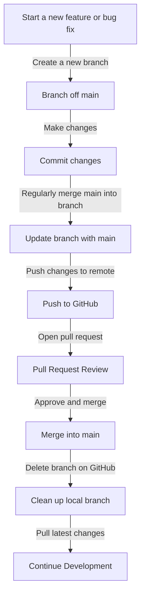

# Welcome to the Universal Athletics App!

---

## Start here if you are new to this project! 
We are excited to have you on board!

---


## Tech Stack
- # Frontend
   **React Native**: A framework for building native mobile applications using React.
- # Backend
   **Spring Boot**: Java-based framework for building scalable, enterprise-grade applications.
- # UI Styling
   **Tailwind CSS**: A utility-first CSS framework for rapidly building custom designs.
- # Routing
- **Expo**: A set of tools and services for building, deploying, and managing React Native apps.
- # State Management and Debugging
 - **Redux**: Controls Data flow across components in the app. Includes devtools for debugging.
- # Authentication
- **Firebase**: A cloud-based platform for building and scaling real-time applications.
- # Database
- **MySQL**: A popular open-source relational database management system.
- # API Integration
  - **Axios**: A promise-based HTTP client for making API requests.
- # Unit Testing
  - **Jest**: A JavaScript testing framework for creating and running tests.
  - **React Testing Library**: A library for testing React components.
- # Integration Testing
  - **Cypress**: A testing framework for end-to-end testing of web applications.
- # Deployment
  - **Heroku**: A cloud platform for deploying and managing applications.
  - **Netlify**: A platform for deploying and hosting static websites and web applications.
- # Payment Processing
   - **Stripe**: A payment processing platform for accepting online payments.

--


## Installation and Setup

### Step 1: Install Node.js and npm
1. Navigate to the following link to install Node.js and npm: [Node.js Download](https://nodejs.org/en/download/)
2. Choose the appropriate installer for your operating system:
   - **Windows**: Select the Windows Installer (.msi)
   - **macOS**: Select the macOS Installer (.pkg)
3. Run the installer and follow the instructions.
4. Verify that Node.js and npm are installed by running the following commands in a terminal or command prompt:
   ```bash
   node -v   # Should return the Node.js version number
   npm -v    # Should return the npm version number
   ```

### Step 2: Install Expo CLI
1. Open a terminal or command prompt and type the following command to install Expo CLI globally:
   ```bash
   npm install -g expo-cli
   ```
2. Verify the installation:
   ```bash
   expo --version   # Should return the Expo CLI version number
   ```

### Step 3: Set up the project directory
1. Create a new folder for the project.
2. Navigate to that folder in the terminal or command prompt:
   ```bash
   cd <new-folder-name>
   ```
3. Clone the remote repository into your local folder:
   ```bash
   git clone https://github.com/benjamintowle04/Universal-Athletics-App.git
   ```

### Step 4: Navigate to the frontend directory
```bash
cd ./frontend
```

### Step 5: Install the needed dependencies
1. Run the following commands to install dependencies:
   ```bash
   npx expo install firebase
   npm install @react-navigation/native @react-navigation/native-stack
   npx expo install react-native-screens react-native-safe-area-context
   npx expo install expo-font
   ```

---

## Running the App

### Step 1: Install Expo Go on your mobile device
- Download the **Expo Go** app from the [App Store](https://apps.apple.com/) or [Google Play Store](https://play.google.com/).

### Step 2: Start the development server
1. Run the following command:
   ```bash
   npx expo start
   ```
2. A QR code will appear in the terminal or command prompt.
3. Scan the QR code with the **Expo Go** app on your mobile device.
4. The app should now be running on your mobile device.

---

## Git and Naming Conventions

### Git Rules
1. **Branch Categories**:
   - `feature/<feature-name>`: For new features
   - `bug/<bug-name>`: For bug fixes
   - `docs/<documentation-name>`: For documentation changes
2. **Commit Message Format**:
   - Example: `feature/user-authentication: Add user authentication functionality`
3. **Main Branch Protection**:
   - Never make changes directly to the `main` branch.
   - Always create a new branch for your changes.
4. **Pull Requests**:
   - Once changes are complete, create a pull request to merge your branch into the `main` branch.

### Naming Conventions
1. **Folders**:
   - Use lowercase letters with words separated by underscores.
   - Example: `screens`, `node_modules`
2. **Files**:
   - **`.tsx` files**: Capitalize the first letter of each word.
     - Example: `App.tsx`, `SignUp.tsx`
   - **`.ts`, `.js`, `.png` files**: Use lowercase letters with words separated by underscores.
     - Example: `firebase_config.ts`

---

## Frequently Used Git Commands

### Push Changes to Git
```bash
git add .
git commit -m "<commit-message>"
git push origin <branch-name>
```

### Create and Checkout a New Branch
```bash
git checkout -b <branch-name>
```

### Update Your Branch with the Latest Changes from `main`
```bash
git checkout <branch-name>
git pull origin main
```

### Create a Pull Request
1. Push your changes to the remote repository:
   ```bash
   git push origin <branch-name>
   ```
2. Go to the repository on GitHub.
3. Click the **Pull Requests** tab.
4. Click **New Pull Request**.
5. Select your branch as the source and `main` as the target.
6. Add a title and description for your pull request.
7. Submit the pull request.

### Delete the Branch After Merging
1. Once the pull request is merged, delete the branch on GitHub by clicking the **Delete branch** button.
2. Delete the branch locally:
   ```bash
   git branch -d <branch-name>
   ```
   If the branch is not fully merged yet, use:
   ```bash
   git branch -D <branch-name>
   ```

---

## Visual Summary of the Git Workflow



---
