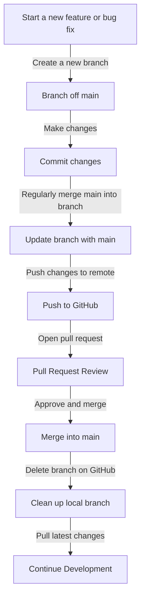

# Git Guide

## Frequently Used Git Commands

### Push Changes to Git
```bash
git add .
git commit -m "<commit-message>"
git push origin <branch-name>
```

### Create and Checkout a New Branch
```bash
git checkout -b <branch-name>
```

### Update Your Branch with the Latest Changes from `main`
```bash
git checkout <branch-name>
git pull origin main
```

### Create a Pull Request
1. Push your changes to the remote repository:
   ```bash
   git push origin <branch-name>
   ```
2. Go to the repository on GitHub.
3. Click the **Pull Requests** tab.
4. Click **New Pull Request**.
5. Select your branch as the source and `main` as the target.
6. Add a title and description for your pull request.
7. Submit the pull request.

### Delete the Branch After Merging
1. Once the pull request is merged, delete the branch on GitHub by clicking the **Delete branch** button.
2. Delete the branch locally:
   ```bash
   git branch -d <branch-name>
   ```
   If the branch is not fully merged yet, use:
   ```bash
   git branch -D <branch-name>
   ```

---

## Visual Summary of the Git Workflow



---

## Additional Git Commands

### Stash Changes
If you need to switch branches but have uncommitted changes, you can stash them:
```bash
git stash
```
To apply the stashed changes later:
```bash
git stash apply
```

### View Commit History
To view the commit history of your branch:
```bash
git log
```

### Revert a Commit
To revert a specific commit:
```bash
git revert <commit-hash>
```

### Reset to a Previous Commit
To reset your branch to a previous commit (destructive):
```bash
git reset --hard <commit-hash>
```

### View Branches
To view all branches in your repository:
```bash
git branch -a
```

### Delete a Remote Branch
To delete a branch from the remote repository:
```bash
git push origin --delete <branch-name>
```

---

## Best Practices

### Commit Messages
- Use clear and concise commit messages.
- Follow the convention: `type(scope): subject`
  - Example: `feat(auth): add login functionality`

### Branch Naming
- Use descriptive branch names.
- Follow the convention: `type/short-description`
  - Example: `feat/login-page`

### Regularly Sync with `main`
- Regularly merge changes from `main` into your branch to avoid conflicts.

### Code Reviews
- Request code reviews for your pull requests.
- Address feedback promptly.

---

By following these guidelines and using the provided commands, you can effectively manage your Git workflow and collaborate with your team.